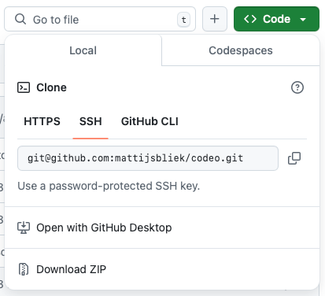

# Codeo-opdrachten
Wat leuk dat je zelf aan de gang wil met de opdrachten van Codeo! Hier vind je alle code om te beginnen met de opdrachten, maar je moet zelf nog wel wat installeren voordat je aan de gang kan. Als je op zoek bent naar de antwoorden, kan je die [hier](https://github.com/mattijsbliek/codeo/tree/answers) vinden.

## Wat vind je in iedere map?
- In `dag1` staat de simpele HTML- en CSS-opdrachten van de eerste dag; 
- In `dag2` vind je de drumcomputer die we op dag 2 gemaakt hebben;
- In `dag3` staat de code voor het whack-a-mole (of whack-a-mollie) spel van dag 3;
- En in `dag4` staat de code voor het klik-spelletje van de laatste dag.

Ook vind je in iedere map een `README.md` bestand, waarin staat hoe je de code voor die dag kan draaien.

## Wat moet je installeren?
Voordat je de code van `dag3` en `dag4` kan draaien, moet je nog een programma installeren. Dit is `npm`, en die kan je [hier](https://nodejs.org/en/download/prebuilt-binaries) downloaden. 

Tijdens Codeo hebben we gebruik gemaakt van VSCode om de code te bewerken, die kan je [hier](https://code.visualstudio.com/download) downloaden.

## Hoe download je de code?
De kan je hele set met Codeo-opdrachten downloaden door hierboven op de groene 'Code' knop te klikken, en daarna te kiezen voor 'Download ZIP'. Dan wordt de code automatisch gedownload op jouw computer.

